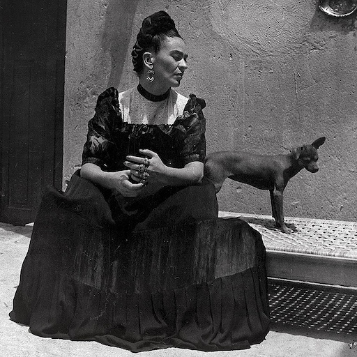
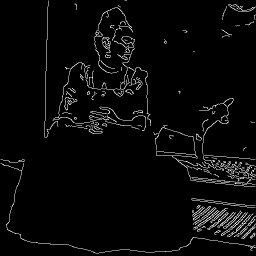

# ControlNet in Rust



An example of ControlNet in Rust. This example makes use of two crates:
- `tch-rs`: Rust bindings for the PyTorch C++ API
- `diffusers-rs`: A Rust implementation of HuggingFace's Diffusers Python library. Written with `tch`.

More examples (including this one) can be found in the main `diffusers-rs` repository.

## Download Weights

First download weights using the following:
```bash
cd scripts
python get_weights.py
```

This will download weights Stable Diffusion 1.5 and ControlNet and place them under `${ROOT}/data`.

## Build and Run

Recall that running `cargo run` will automatically build a debug executable and run it.
The following command will build and run on a CPU-only machine:

```bash
cargo run --  --input-image 'media/frida-kahlo.jpg' --prompt 'A colorful portrait painting in the style of Frida Kahlo' --cpu 'all'
```

