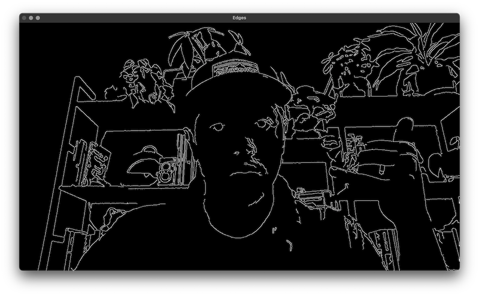

# Opencv and Rust on macOS



## Setup

### Install OpenCV

Using the unofficial `opencv` Rust crate requires OpenCV to be installed on your system.
Installing OpenCV on macOS tends to be a bit more complicated than on other systems.
The simplest, yet less flexible, approach is to install with Homebrew:
```
brew install opencv
```
WARNING: this might take a while and install a lot of dependencies.

### Install LLVM
For macOS you can use Homebrew:
```
brew install llvm
``` 

### Setup environment variables
The biggest issue so far is ensuring that the `llvm` and `opencv` libraries are found by th `rustc` Rust compiler. So far this is what works for me:

```bash
export DYLD_FALLBACK_LIBRARY_PATH="$(xcode-select --print-path)/usr/lib/"
export LDFLAGS=-L/Library/Developer/CommandLineTools/SDKs/MacOSX.sdk/usr/lib
export LD_LIBRARY_PATH=${LD_LIBRARY_PATH}:/usr/local/lib
```

## Build and Run

Build and run like any other Rust crate:

```bash
cargo run --release
```

## Bonus:

Try some of the examples from the `opencv` create [repo](https://github.com/twistedfall/opencv-rust/tree/master/examples) including:
- [Face detection](https://github.com/twistedfall/opencv-rust/blob/master/examples/video_facedetect.rs)
- [ORB feature detection](https://github.com/twistedfall/opencv-rust/blob/master/examples/video_features.rs)

## DOUBLE Bonus:

Try reconfiguring to include multiple examples (similar to how it's done in `candle-examples`)
- Write each example in its own `/examples/<example>/main.rs` file
- Configure each example in the `Cargo.toml` file
- Run each example with `cargo run --example <example>`